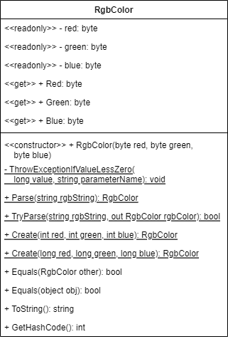

# RGB Color Struct

Beginner level task for practicing structure types and struct declaration.

Before starting with the task learn the basics of [UML language](https://en.wikipedia.org/wiki/Unified_Modeling_Language) and [UML Class Diagrams](https://en.wikipedia.org/wiki/Class_diagram). Search YouTube for [relevant video tutorials](https://www.youtube.com/results?search_query=uml+class+diagram) to get started quickly. Don't waste time! You don't have to master class diagrams. You just need to get a [basic understanding on the topic](https://www.tutorialspoint.com/object_oriented_analysis_design/ooad_uml_basic_notation.htm), and you can always find the answer to your question in the [UML Class Diagrams Reference](https://www.uml-diagrams.org/class-reference.html).

Estimated time to complete the task - 1h.

The task requires .NET 6 SDK installed.

## Task Description

In this task you have to implement a [structure type](https://docs.microsoft.com/en-us/dotnet/csharp/language-reference/builtin-types/struct) that represents a color in the [RGB color model](https://en.wikipedia.org/wiki/RGB_color_model).

Add a new [public](https://docs.microsoft.com/en-us/dotnet/csharp/programming-guide/classes-and-structs/access-modifiers) struct to the [RgbColor.cs](RgbColorStruct/RgbColor.cs) file. The class must fulfill these requirements:
* The struct must have the same name as the file name.
* The struct must be [immutable](https://en.wikipedia.org/wiki/Immutable_object).
* Fields
    * The struct must have the private [readonly](https://docs.microsoft.com/en-us/dotnet/csharp/language-reference/keywords/readonly) `red`, `green` and `blue` fields.
    * The fields must be of the `byte` type.
    * The interval of the valid field values is [0; byte.MaxValue].
* Static methods
    * The struct must have the private `ThrowExceptionIfValueIsNotValid` method to throw an `ArgumentException` if a `value` argument is not valid.
    * The struct must have two public overloaded `Create` methods to initialize a new `RgbColor` object using arguments or integer and long types. The methods must use the `ThrowExceptionIfValueIsNotValid` method to throw an `ArgumentException` if a method argument is not valid.
    * The struct must have the public `Parse` method to parse a string and return a new `RgbColor` object. The object must be initializes with the red-green-blue values from a specified string. The method must throw an `ArgumentException` if the method is not able to parse a string. See the description for the `ToString` method for more details. The method should support both lower-case and upper-case letters.
    * The struct must have the public `TryParse` method to parse a string and return a new `RgbColor` object. The method should follow the [Try-Parse Pattern](https://docs.microsoft.com/en-us/dotnet/standard/design-guidelines/exceptions-and-performance#try-parse-pattern) rules. The method should support both lower-case and upper-case letters.
* Property
    * The class must have the `Red`, `Green` and `Blue` properties to access the struct fields. The property must have only the public [get accessor](https://docs.microsoft.com/en-us/dotnet/csharp/programming-guide/classes-and-structs/using-properties#the-get-accessor).
* Constructor
    * The struct must have a public [constructor](https://docs.microsoft.com/en-us/dotnet/csharp/programming-guide/classes-and-structs/constructors) with `red`, `green` and `blue` parameters that must initialize the struct fields with the given arguments.
* Instance methods
    * The struct must override the `ToString` method to return the string representation of `RgbColor` object.
        * The result string must have the length six characters.
        * Each character must be a [hexadecimal symbol](https://en.wikipedia.org/wiki/Hexadecimal).
        * The result string must have only upper-case characters letters.
        * Concatenate the values of the `red`, `green` and `blue` fields as hexadecimal numbers: (0xAB, 0xCD, 0xEF) => "ABCDEF".
* Define the [value equality](https://docs.microsoft.com/en-us/dotnet/csharp/programming-guide/statements-expressions-operators/how-to-define-value-equality-for-a-type) for the struct:
    * The struct must implement the [IEquatable&lt;T&gt;](https://docs.microsoft.com/en-us/dotnet/api/system.iequatable-1) interface.
    * The struct must have a public `Equals(RgbColor other)` method to determine whether the specified `RgbColor` object is equal to the current object.
    * The struct must override the [Equals(object? obj)](https://docs.microsoft.com/en-us/dotnet/api/system.object.equals) method to determine whether the specified object is equal to the current object. The method argument can be `null` or be of another type.
    * The struct must [overload](https://docs.microsoft.com/en-us/dotnet/csharp/language-reference/operators/operator-overloading) the [equality operator ==](https://docs.microsoft.com/en-us/dotnet/csharp/language-reference/operators/equality-operators#equality-operator-).
    * The struct must overload the [inequality operator !=](https://docs.microsoft.com/en-us/dotnet/csharp/language-reference/operators/equality-operators#inequality-operator-).
    * The struct must override the [GetHashCode](https://docs.microsoft.com/en-us/dotnet/api/system.object.gethashcode) method that must return the object hash code.
        * To calculate a struct hash code shift the values of the values of the `green` and `blue` fields and combine them with the value of the `red` field: (0xAB, 0xCD, 0xEF) => 0xEFCDAB.
        * Use the [binary logical and shift operators](https://docs.microsoft.com/en-us/dotnet/api/system.object.gethashcode) to implement the `GetHashCode` method.
